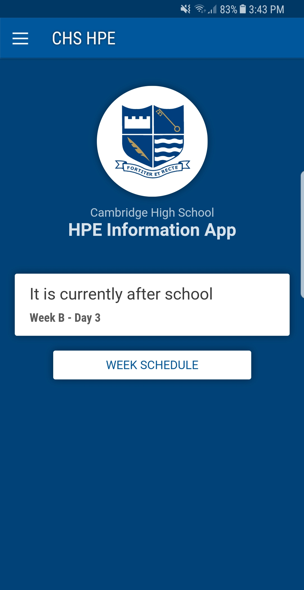
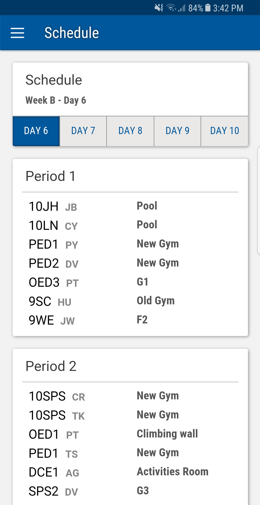

Cambridge High School HPE Timetable App
=======================================

A hybrid mobile app written in React for Cambridge High School, NZ to allow students to quickly recieve information about the location of the Health and Physical Education classes.

Pairs with [CHSHPE-Server](#TODO)

Quick start
-----------
- Make sure Node and npm are installed
- Build using webpack `npm run build`
- Start a local server to view in browser `npm start`
- OR run on a device eg. `cordova run android`

Screenshots
-----------
| Main Screen | Timetable + Locations |
|:-----------:|:---------------------:|
|||